# Geometric Action Model（GAM）深度解读

> 论文：[Geometric Action Model for Robot Policy Learning](https://arxiv.org/abs/2606.17046)（arXiv:2606.17046v2）  
> 项目页：[cvlab-kaist.github.io/Geometric-Action-Model](https://cvlab-kaist.github.io/Geometric-Action-Model/)  
> 代码：[github.com/cvlab-kaist/Geometric-Action-Model](https://github.com/cvlab-kaist/Geometric-Action-Model)  
> 本文解读基于论文 TeX 源码（`b/d/paper/TeX_Source/`）与本仓库本地实现（`src/`），并显式标注论文表述与代码实现的差异。

---

## 0. 导读：一句话理解 GAM

想象你要教机械臂「把桌上的碗放到盘子里」。传统视觉–语言–动作模型（VLA）主要从 **2D 图像语义** 里猜动作；视频世界模型（WAM）则在 **像素/2D 潜空间** 里想象未来画面。它们都把「三维几何」——物体有多远、夹爪会不会撞到、相机一挪画面全变——留给网络自己隐式摸索。

**GAM 的核心想法**：把已经预训练好的几何基础模型（Geometric Foundation Model, GFM，本仓库用的是 **DA3-Giant**）当成策略的「操作系统」——浅层负责看懂当前多视角几何，中间插入一个因果 Transformer 去预测「下一步的几何潜变量 + 动作」，深层再把这些预测 token 解码成未来深度与可执行动作。感知、预测、动作共用同一套几何骨干，一次前向完成。

发布模型约 **1.4B** 参数，在 LIBERO 上成功率 **97.6%**，在扰动更强的 LIBERO-Plus 上 **85.5%**（相机扰动子集 **83.1%**，比次优基线高约 **9.7 个百分点**），单次前向延迟约 **6.9 ms（≈145 Hz）**。

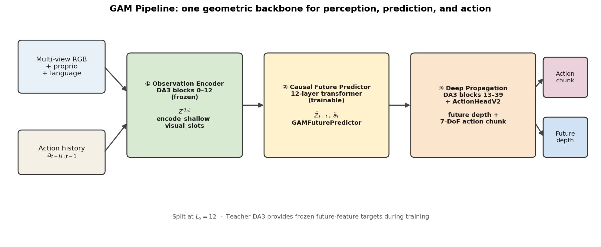

---

## 1. 问题动机：为什么机器人策略需要「显式几何」

### 1.1 接触丰富操作里，几何不是可选项

语言指令告诉机器人「做什么」，但真正决定夹爪轨迹的是：

- 物体相对夹爪的 **3D 位姿与尺度**；
- 遮挡与接触（碗口朝哪、盘子边缘在哪）；
- 相机外参一变，同一场景的 2D 外观分布会剧烈偏移。

若策略只在 2D 外观上拟合专家轨迹，名义分布（in-distribution）上可以刷到很高成功率，但相机平移/旋转一点，策略就容易「认不出」场景——这正是 LIBERO-Plus 相机扰动与真机 OOD 相机设置要检验的能力。

### 1.2 三类范式（论文 Related Work / Figure 2）

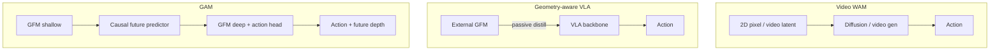

| 范式 | 几何角色 | 时序角色 | 推理形态 | 典型短板 |
|------|----------|----------|----------|----------|
| Video WAM | 隐式（2D） | 强（视频先验） | 多步扩散，慢 | 深度/尺度/遮挡不显式；延迟高 |
| Geometry-aware VLA | 侧路蒸馏 | 弱–中 | 仍是 VLA 前向 | GFM 被动，未成为策略基底 |
| **GAM** | GFM 即策略基底 | 在 GFM 潜空间做因果预测 | 单次前向 | 语言推理受冻结文本编码器限制 |

生活化类比：Geometry-aware VLA 像是「请一位 3D 专家写备忘录给策略看」；GAM 则是「直接让 3D 专家本人来当策略的大脑，只在中间加一个会说话、会记动作历史的时间皮层」。

---

## 2. 纵向分析：方法从何而来、又往何处去

### 2.1 演进链条

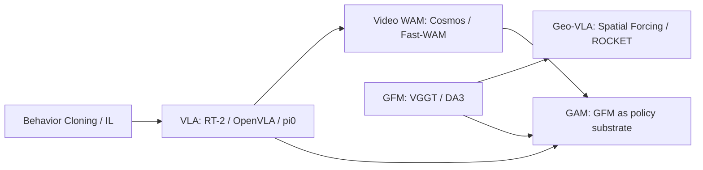

#### （1）模仿学习 → VLA

早期行为克隆在固定任务上有效，但泛化与语言条件弱。VLA 把大规模视觉–语言模型微调成策略：语义开放词汇强，动作可用离散 token、并行解码（OpenVLA-OFT）或流匹配/扩散专家（π₀ / π₀.₅）。**优点**：指令跟随好、数据规模可扩展。**缺点**：表征仍以 2D 为主，几何接触推理靠隐式拟合。**适合**：名义分布、语言复杂、几何扰动不极端的场景。

#### （2）世界–动作模型（WAM）

在视频生成骨干上联合预测未来帧与动作（如 Cosmos-Policy），或在冻结视觉特征上做时序预测再规划。**优点**：时序一致性与「想象未来」的训练信号。**缺点**：2D 潜空间不显式解深度/尺度；扩散式推理慢（论文表：Cosmos-Policy 约 382 ms）。**适合**：需要强视频先验、对延迟不敏感的离线规划。

#### （3）GFM 进入操作：从「特征提取」到「策略基底」

VGGT、DA3 等 GFM 从多视角 RGB 前馈估计稠密深度/点图与相机。早期用法是冻结 GFM、对齐到 VLA 中间特征（Spatial Forcing、ROCKET）或替换编码器。**优点**：注入几何。**缺点**：GFM 仍是被动侧信号；论文显示 π₀.₅+Spatial Forcing 在 LIBERO-Plus 上崩得很厉害（Plus 仅 25.7%，相机扰动近 0）。

并发工作中，有的用 GFM 联合预测动作与**当前帧** 3D 属性，有的用扩散在动作与 3D latent 上共去噪。GAM 的差异（论文 Related Work）是：

1. 动作与未来场景在 **同一自回归 token 序列** 中联合建模；
2. GFM **深层**被明确用来解码**预测的未来 token**，而不只是处理观测。

#### （4）GAM 之后可能的方向（展望，非本文贡献）

论文 Limitation 指出语言推理受冻结文本编码器限制。自然延伸包括：可训练/更强的语言骨干、更长 horizon 与多臂、把几何世界模型接到规划器而非仅 BC。本仓库当前公开实现聚焦 LIBERO / LIBERO-Plus 的训练与闭环评估。

### 2.2 各阶段适用场景速查

| 阶段/方法 | 更适合 | 不太适合 |
|-----------|--------|----------|
| 纯 VLA | 语义复杂、相机稳定 | 强相机 OOD、极低延迟 |
| Video WAM | 需要视频级时序先验 | 实时控制（百 Hz） |
| Geo-VLA 蒸馏 | 给现有 VLA 补一点几何 | 把几何当主鲁棒性来源 |
| **GAM** | 相机扰动、接触操作、低延迟 | 极强开放域语言推理 |

---

## 3. 横向分析：同期同类方法对比

数据来自论文 Table 1（`tables/libero_plus_agg.tex`）与推理延迟表。

### 3.1 主结果一览

| Method | Size | LIBERO ↑ | LIBERO-Plus ↑ | Camera ↑ |
|--------|------|----------|---------------|----------|
| π₀.₅ | 3.3B | 96.9 | 84.6 (↓12.3) | 72.0 |
| OpenVLA-OFT | 7B | 97.1 | 69.6 (↓27.5) | 56.4 |
| Cosmos-Policy | 2B | **98.5** | 82.4 (↓16.1) | 73.4 |
| Fast-WAM | 6B | 97.6 | 50.0 (↓47.5) | 16.4 |
| π₀.₅ + Spatial Forcing | 3.3B | 94.0 | 25.7 (↓58.3) | 0.1 |
| π₀.₅ + ROCKET | 3.3B | 95.3 | 47.5 (↓46.6) | 30.9 |
| **GAM** | **1.4B** | 97.6 | **85.5 (↓12.1)** | **83.1** |

解读要点：

- **名义 LIBERO 已饱和**：各强方法都在 95%+，单看 Orig. 难分高下。
- **Plus 与 Camera 才是分水岭**：GAM 掉点最小之一，且相机子集显著领先（+9.7%p vs 次优）。
- **「加几何蒸馏」≠「更鲁棒」**：Spatial Forcing / ROCKET 在 Plus 上大幅落后，说明被动对齐不足以在视角变化下稳住策略。
- **速度与体量**：GAM 6.9 ms vs Cosmos 382.4 ms、OpenVLA-OFT 77.8 ms、π₀.₅ 29.2 ms；参数 1.4B 小于多数 2–8.5B 基线。

### 3.2 优缺点与场景（横向小结）

| 家族 | 代表 | 优势 | 劣势 | 适合场景 |
|------|------|------|------|----------|
| VLA | π₀.₅, OpenVLA-OFT | 语义/指令、生态成熟 | 相机 OOD 掉点、更大更慢 | 名义分布、语言复杂任务 |
| WAM | Cosmos-Policy, Fast-WAM | 时序先验、部分 Orig. 极高 | 慢或几何隐式、Plus 不稳 | 离线/可接受高延迟 |
| Geo-VLA | Spatial Forcing, ROCKET | 实现上易「外挂」几何 | 被动蒸馏，强扰动崩 | 几何辅助微调实验 |
| **GAM** | 本仓库 | 鲁棒+快+轻，几何贯穿 | 语言侧冻结编码器 | 相机扰动、实时接触控制 |

真机方面，论文在四项接触任务上对比 π₀.₅ 与 Spatial Forcing：每任务约 200 条遥操作演示，评估 20 trials（10 ID + 10 外置相机平移 85 cm、旋转 45° 的 OOD）。GAM 在 ID/OOD 上均领先，说明仿真中的几何鲁棒性可迁移到物理设置（真机无 GT 深度时，用预训练 GFM 伪深度作监督）。

---

## 4. 方法精讲：论文公式 ↔ 本地代码

### 4.1 预备知识：GFM（DA3）在做什么

给定 $V$ 个视角图像，GFM 将每张图切成 $P$ 个 patch，得到每视角 token 序列（含 camera/CLS 类前缀），再经 $M$ 层 Transformer。注意力在 **frame-wise**（视角内）与 **global**（跨视角）之间交替。多层中间特征送入 DPT 头解码稠密几何。

本仓库封装类为 `DA3GiantEncoder`（`src/robot/modeling/da3_giant_encoder.py`）：

- 默认 `model_name="da3-giant"`，`OUT_LAYERS = [19, 27, 33, 39]` 供 DPT；
- `shallow_target_layer = alt_start - 1`，对 Giant 即 **block 12**（`alt_start=13` 起注入 camera/action 并进入交替注意力）。

### 4.2 问题形式化

策略在历史窗口 $H$ 上映射到动作 chunk $\hat{a}_t \in \mathbb{R}^{C \times d_a}$（本实现 $C=8$，$d_a=7$）：

$$
\pi_\theta\colon
\big(\{o_{t-H+1},\ldots,o_t\},\,
\{s_{t-H+1},\ldots,s_t\},\,
\{a_{t-H},\ldots,a_{t-1}\},\,
\ell\big)
\;\mapsto\;
\hat a_t
$$

### 4.3 三阶段架构

在 split 层 $L_s$ 处切开 GFM：

$$
E_{\le L_s}=f^{(L_s)}\circ\cdots\circ f^{(1)},
\qquad
D_{>L_s}=f^{(M)}\circ\cdots\circ f^{(L_s+1)}.
$$

约束：$L_s$ 要够深以提取几何特征，又要满足 $L_s < m_1$（DPT 最早层，代码里为 19），以便预测的未来 token 仍能被深层与 DPT 解码。

#### ① 观测编码 → `encode_shallow_visual_slots`

对窗口内每一步多视角 RGB 跑 blocks 0–$L_s$，得到 $\mathbf{Z}_{t'}^{(L_s)}$。代码返回布局为 `[CLS, registers, patches]`，**不注入 action token**（action 在深层续跑时再注入）。

```1046:1090:src/robot/modeling/da3_giant_encoder.py
    def encode_shallow_visual_slots(
        self,
        images: torch.Tensor,
        T: int,
        V: int,
        target_layer: Optional[int] = None,
    ) -> Dict[str, torch.Tensor]:
        """Export DA3 pre-global visual tokens before `alt_start`.
        ...
        The returned layout preserves DA3's visual token order before action
        insertion: `[CLS, registers, patches]`. No camera/action tokens are
        inserted here; those are supplied when resuming from `alt_start`.
        """
        ...
        return {
            "visual_tokens": visual.reshape(batch_size, int(T), int(V), visual.shape[2], self.embed_dim),
            ...
        }
```

冻结边界：

```406:414:src/robot/modeling/da3_giant_encoder.py
    def freeze_blocks_before(self, block_idx: int):
        """Freeze patch embed and all backbone blocks below ``block_idx``."""
        ...
                param.requires_grad = int(parts[1]) >= block_idx
```

配置 `freeze_blocks_before: 13` ↔ 论文 $L_s=12$（冻结 0–12，训练 13–39）。

#### ② 因果未来预测器 → `GAMFuturePredictor`

对每步嵌入本体 $s_{t'}$ 与上一动作 $a_{t'-1}$，与几何 token 拼成块，再与语言 token 一起做 **block-causal** 自注意力，读出：

- 下一步几何 $\tilde{\mathbf{Z}}_{t'+1}^{(L_s)}$；
- 动作 token $\tilde{\mathbf{a}}_{t'}$（类比 LM 的 next-token）。

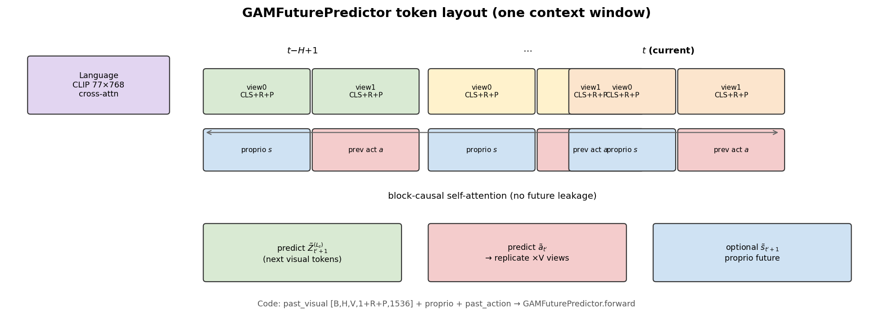

```1389:1455:src/robot/modeling/future_predictor.py
    def forward(
        self,
        past_visual_tokens: torch.Tensor,       # (B, H, V, 1+R+P, d_da3)
        proprio: Optional[torch.Tensor] = None,
        proprio_history: Optional[torch.Tensor] = None,     # (B, H, proprio_dim)
        past_action_history: Optional[torch.Tensor] = None, # (B, H, chunk, action_dim)
        lang_feats: Optional[torch.Tensor] = None,
        ...
    ) -> dict:
        ...
        # 3. Assemble per-step blocks and flatten across steps.
        step_blocks = torch.cat([context, proprio_tokens, action_history_tokens], dim=2)
        ...
        x = step_blocks.reshape(b, -1, self.d_model)
```

实现细节（相对论文的「工程展开」）：

- 宽度 $d_g=1024$，深度 12，RoPE（视觉轴向 4D + proprio/action 1D），QK-RMSNorm，SwiGLU；
- `flex_attention` + `BlockMask` 做因果掩码（需 `torch.compile`，eager 易 OOM）；
- 语言默认 **cross-attn**；另有 `concat` / `film`；
- 推理可用 `forward_incremental()` 做 KV cache。

#### ③ 特征传播与动作解码

将 $\tilde{\mathbf{a}}$ 复制到 $V$ 个视角，与预测几何 token 一并送入 $D_{>L_s}$，再：

- **ActionHeadV2**：对 per-view action token 做 mean-pool → MLP-ResNet → $C\times 7$ 连续 delta 动作；
- **DPT depth head**（训练时可选）：解码未来深度。

```26:41:src/robot/modeling/action_head_v2.py
class ActionHeadV2(nn.Module):
    """Predict continuous actions from per-view DA3 action tokens.
    ...
        chunk_size: Number of sub-actions per timestep.
        pool_mode: 'mean' for view-agnostic mean pooling,
        chunk_position_encoding: 'learned' gives each sub-action a learned order
                   embedding before the MLP blocks.
    """
```

深层续跑入口：`propagate_shallow_with_actions` / `_grad`（`da3_giant_encoder.py`）。

### 4.4 训练目标

论文：

$$
\mathcal{L}_{\text{total}}
=
\lambda_{\text{act}}\mathcal{L}_{\text{act}}
+
\lambda_{\text{feat}}\mathcal{L}_{\text{feat}}
+
\lambda_{\text{depth}}\mathcal{L}_{\text{depth}}
$$

其中 $\mathcal{L}_{\text{feat}}$ 将预测未来 token 与 **冻结 GFM** 在真实下一帧上的 $\mathbf{Z}_{t'+1}^{(L_s)}$ 做 $\ell_1$ 对齐；$\mathcal{L}_{\text{depth}}$ 为尺度不变 + 梯度匹配类深度损失。

本地主路径 `compute_gam_forward_loss`（`src/robot/losses/unified_loss.py`）在此基础上展开为：

| 损失 | 含义 | 典型配置键 |
|------|------|------------|
| `L_action_direct` | predictor 输出的 action token 直接过 ActionHead | `training.lambda_action_direct` |
| `L_action_refine` | 经 DA3 deep 后再过 ActionHead | `training.lambda_action_refine` |
| `L_action` | 上两者加权和，再乘 `lambda_action` | `training.lambda_action`（默认 3.0） |
| `L_feat_future` | 预测视觉 vs teacher shallow | `predictor.lambda_feat_future`（1.0） |
| `L_depth` | 未来深度监督 | `regularization.lambda_depth`（主配置 **0.05**） |
| 可选 | SIGReg、proprio future、Path-B deep feat | 对应 `lambda_*` |

> **论文–代码差异（损失权重）**：论文实现细节写 $\lambda_{\text{depth}}=3$；本仓库主训练配置 `chunk8_150k_2node.yaml` 中为 `regularization.lambda_depth: 0.05`。解读实验数字时以论文表为准，复现训练时以本地 YAML 为准。

### 4.5 符号 → 张量 → 代码变量

| 论文符号 | 典型形状（本仓库默认） | 代码变量 / 位置 |
|----------|------------------------|-----------------|
| $o_t$，多视角 RGB | `(B, T*V, 3, 224, 224)` | `all_views_norm` |
| $\mathbf{Z}^{(L_s)}$ | `(B, H, V, 1+R+P, 1536)` | `past_visual` / `visual_tokens` |
| $s_t$ | `(B, H, 7)` | `proprio_history` |
| $a_{t-1}$ chunk | `(B, H, C, 7)` | `past_action_history` |
| $\ell$ | `(B, 77, 768)` | `lang_feats`（CLIP） |
| $\tilde{\mathbf{Z}}_{t+1}$ | `(B, H, V, 1+R+P, 1536)` | `predicted_next_visual_tokens` |
| $\tilde{\mathbf{a}}$ | `(B, H, V, 1536)` | `predicted_action_tokens` |
| $\hat{a}$ | `(B, H, C, 7)` | ActionHead 输出 |
| $L_s=12$ | — | `freeze_blocks_before=13`, `shallow_target_layer=12` |

### 4.6 必须记住的论文–代码差异

| 点 | 论文 | 本仓库代码 |
|----|------|------------|
| 语言编码器 | 冻结 **T5** | 默认 **CLIP ViT-L/14**（`TextConditioner` 可切 T5） |
| 后训练 $H$ | 写死 $H=1$ | `H_choices=[1..7]` 加权采样（短 H 权重更高） |
| 动作监督 | 主文强调经深层解码 | **direct + refine** 双路 L1（附录消融对应） |
| Split 配置 | $L_s=12$ | `freeze_blocks_before: 13` |
| $\lambda_{\text{depth}}$ | 文中写 3 | 主 YAML 为 0.05 |

---

## 5. 消融分析：哪些设计被实验证明有效

数据来自论文 Table 3/4（`tables/ablation_and_depth.tex`）与附录 C；柱状图见下。

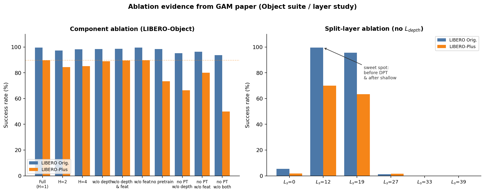

### 5.1 组件消融（LIBERO-Object）

| Pretrain | $L_{\text{depth}}$ | $L_{\text{feat}}$ | H | Orig. | Plus |
|----------|--------------------|-------------------|---|-------|------|
| ✓ | ✓ | ✓ | **1** | **99.6** | **89.7** |
| ✓ | ✓ | ✓ | 2 | 97.2 | 84.4 |
| ✓ | ✓ | ✓ | 4 | 98.2 | 85.1 |
| ✓ | ✗ | ✓ | 1 | 98.4 | 89.0 |
| ✓ | ✗ | ✗ | 1 | 98.6 | 89.5 |
| ✓ | ✓ | ✗ | 1 | 99.6 | 89.7 |
| ✗ | ✓ | ✓ | 1 | 98.4 | 73.4 |
| ✗ | ✗ | ✓ | 1 | 95.2 | 66.5 |
| ✗ | ✓ | ✗ | 1 | 96.4 | 80.0 |
| ✗ | ✗ | ✗ | 1 | 93.6 | 50.0 |

**结论（有效性排序）**：

1. **预训练 ≫ 其它**  
   去掉预训练后 Plus 从 89.7 → 73.4；若再去掉两个未来损失，Plus 崩到 50.0。预训练把几何动力学写进骨干，是 OOD 鲁棒性的主来源。

2. **有预训练时，$L_{\text{depth}}$ / $L_{\text{feat}}$ 边际很小**  
   去掉其一或两者，Plus 仍约 89–89.7。说明大规模预训练已编码几何动态，后训练损失更多是「巩固」而非「从零注入」。

3. **无预训练时，未来损失很值钱**  
   仅保留 depth 或 feat 都能把 Plus 从 50 拉回 66–80。实践含义：若你没有 784K 预训练权重，至少保留未来特征/深度监督。

4. **$H=1$ 优于更长历史**  
   H=2/4 在 Plus 上低 4–5 点。更长上下文易引入伪相关（论文引用因果/干扰文献）。这与「看起来历史越长越好」的直觉相反。

### 5.2 Split 层 $L_s$（该实验关闭 $L_{\text{depth}}$）

| $L_s$ | Orig. | Plus |
|-------|-------|------|
| 0 | 5.4 | 1.8 |
| **12** | **99.6** | **70.1** |
| 19 | 95.6 | 63.4 |
| 27 | 1.2 | 1.6 |
| 33/39 | 0.0 | 0.0 |

**解读**：太浅（0）特征不够；太深（≥27）预测 token 几乎没有剩余深层可「消化」进预训练 3D 先验，且可能越过 DPT 可用层。$L_s=12$ 正好在 frame-wise → 跨视角交替注意力的接缝处，是架构甜区。

### 5.3 附录：何时预测动作？（Direct vs Refine）

| Variant | Orig. | Plus |
|---------|-------|------|
| Direct-action（不经深层） | 98.4 | 84.1 |
| **GAM（经深层精炼）** | **99.6** | **89.7** |

深层 GFM 对动作 token 的精炼在 Plus 上约 **+5.6%p**。代码中两路都开：

```1103:1159:src/robot/losses/unified_loss.py
    if float(lambda_action_direct) > 0.0:
        predicted_actions_direct = _run_action_head(predicted_action_tokens, ...)
        loss_action_direct = _masked_l1_loss(...)
    ...
    deep_out = student_da3.propagate_shallow_with_actions_grad(
        deep_visual,
        deep_actions,
        **propagate_kwargs,
    )
    ...
    loss_action_refine = _masked_l1_loss(action_pred, target_actions, ...)
    loss_action = (
        float(lambda_action_direct) * loss_action_direct_for_total
        + float(lambda_action_refine) * loss_action_refine
    )
```

复现「仅 Direct」：设 `lambda_action_refine=0`；「仅 Refine」：设 `lambda_action_direct=0`。

### 5.4 在本仓库复现消融的配置开关

| 消融意图 | 配置 |
|----------|------|
| 关深度损失 | `regularization.lambda_depth: 0` |
| 关特征蒸馏 | `predictor.lambda_feat_future: 0` |
| 固定 H | `predictor.H_choices: [1]`, `H_weights: [1.0]` |
| 改 split | `da3_finetune.freeze_blocks_before` + `shallow_layer` |
| 无语言 | `predictor.use_language: false` |
| 无预训练 | 不加载 / 随机初始化 `stage_1.ckpt_path` 与 GAM pretrained ckpt（需自行控制） |

**有效性总排序（科普结论）**：  
预训练 ≫ split 层选择 > 深层 action refine > 未来损失（无预训练时重要；有预训练时次要）> 更长 H（往往有害）。

---

## 6. 静态架构：组件、类与职责

### 6.1 仓库模块图

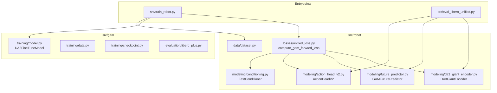

### 6.2 类职责表

| 类 / 函数 | 文件 | 职责 |
|-----------|------|------|
| `DA3GiantEncoder` | `da3_giant_encoder.py` | 包装 DA3 骨干；浅层编码、深层传播、action token 注入、可选深度解码 |
| `GAMFuturePredictor` | `future_predictor.py` | 在 $L_s$ 做 block-causal 未来几何/动作/本体预测 |
| `ActionHeadV2` | `action_head_v2.py` | action token → 连续 7-DoF chunk |
| `TextConditioner` | `conditioning.py` | 冻结 CLIP/T5 + 可选投影；`encode_tokens` 供 predictor |
| `ProprioConditioner` | `conditioning.py` | 本体 MLP（legacy 路径为主） |
| `FeatureRegularizer` | `reg_loss.py` | 多层特征蒸馏（legacy / Path-B） |
| `DA3FineTuneModel` | `gam/training/model.py` | 容器；其 `forward()` 是 **legacy** `encode_with_actions` 直连 |
| `compute_gam_forward_loss` | `unified_loss.py` | **当前主训练** 前向+损失 |

重要提醒：`DA3FineTuneModel.forward` **不是** GAM 主训练路径：

```32:39:src/gam/training/model.py
    def forward(self, images, proprio=None, action_input=None, force_action_input=False):
        features_per_level, action_tokens, raw_levels = self.student_da3.encode_with_actions(
            images,
            action_input=action_input,
            force_action_input=force_action_input,
        )
        action_pred = self.action_head(action_tokens)
        return action_pred, raw_levels, features_per_level
```

当 `predictor.type: gam` 时，`train_robot.py` 调用 `compute_gam_forward_loss`，在外部编排 student/teacher/predictor/deep/action head。

### 6.3 参数量（论文附录）

| Module | Params | Trainable? |
|--------|--------|------------|
| backbone ViT-Giant 40 blocks | 1136.5M | blocks 13–39 ≈765M |
| DPT head | 50.1M | frozen |
| Causal Future Predictor | 210.2M | trainable |
| action head | 8.0M | trainable |
| **Total** | **≈1.40B** | **≈983M trainable** |

---

## 7. 动态架构：数据流、序列与梯度

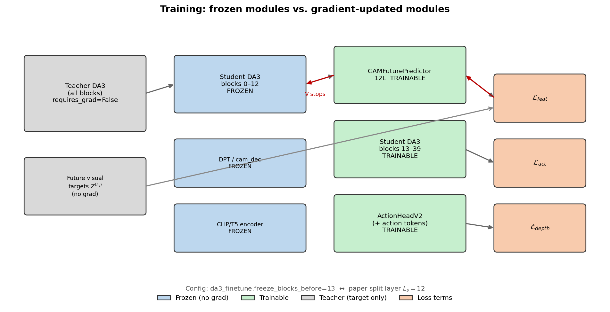

### 7.1 训练一步：数据流

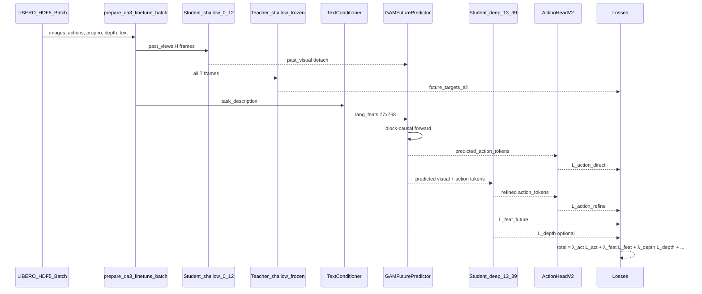

对应代码骨架（`compute_gam_forward_loss`）：

1. `student_da3.encode_shallow_visual_slots(past_views, T=H, V)` → `past_visual`（再 `.detach()`，浅层无梯度）；
2. `teacher_da3.encode_shallow_visual_slots(..., T=T)` under `no_grad` → 未来目标；
3. `text_conditioner.encode_tokens` → `lang_feats`；
4. `future_predictor(...)` → `predicted_next_visual_tokens`, `predicted_action_tokens`；
5. Direct action L1；`propagate_shallow_with_actions_grad` → refine action L1；
6. 特征 L1/L2；可选深度损失；聚合 `total_loss`。

H 在训练循环中按 `H_choices` / `H_weights` 采样（短窗口优先），与论文「后训练 H=1」叙述并存：代码更灵活，消融表明 H=1 最稳。

### 7.2 推理一步：闭环策略

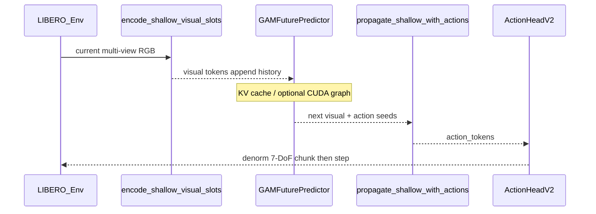

入口：`src/eval_libero_unified.py` 的 policy 构建与 `call_policy`。可选环境变量将 h=1 路径熔成 CUDA graph（`DA3_MAX_OPTIMIZE=1` 等），对应论文 6.9 ms 延迟测量路径。

### 7.3 Backward：谁更新、谁冻结

| 模块 | 梯度 |
|------|------|
| Teacher DA3 全部 | 无（`requires_grad=False`, `eval()`） |
| Student blocks 0–12、patch embed | 无（`freeze_blocks_before(13)`） |
| DPT head / cam_dec | 无（初始化即冻） |
| CLIP/T5 文本编码器 | 无 |
| Student blocks 13–39 | **有** |
| `action_token` / `action_input_proj` 等 | **有** |
| `GAMFuturePredictor` | **有** |
| `ActionHeadV2` | **有** |
| Text proj（若走 DiT/proj 路径） | 视配置 |

注意：训练时 student 浅层输出被 **detach** 再送入 predictor，因此即使浅层未冻，当前 GAM 路径也不会把梯度回传到 0–12；冻结是为了稳定几何编码器并省显存/算力。

学习率分组（主配置）：`base_lr=5e-5`，`head_lr_mult=10`，`predictor_lr_mult=0.2`——动作头学得更快，predictor 相对保守，避免破坏与 DA3 特征的对齐。

---

## 8. 关键代码精读：四个函数读懂 GAM

下面用「把碗从桌心放到盘子」这一 LIBERO-Spatial 式任务串起来。

### 8.1 `encode_shallow_visual_slots`：把像素变成几何 token

输入是已经按 DA3 约定归一化（且常 `da3_input_rotate180: true`）的多视角图。对历史 $H$ 步、每步 $V=2$ 相机，得到每视角约 $1+R+256$ 个 1536 维 token。这些 token 还不是「动作」，而是「当前场景的几何中间表示」——碗、盘、桌面的空间关系已开始在跨 patch 注意力里成形，但尚未进入跨时间的因果预测。

### 8.2 `GAMFuturePredictor.forward`：在几何语言里做 next-token

拼装每步块：`[view0 tokens | view1 tokens | proprio | prev_action]`，在时间维上 block-causal：预测「下一步碗会更靠近盘子」的几何 token，同时从 prev_action 槽位读出「下一步该怎么动」的 action seed。语言（「move the bowl … to the plate」）通过 cross-attn 注入，相当于给几何世界模型一个任务偏置。

输出字典关键键（保持稳定，便于 checkpoint）：

- `predicted_next_visual_tokens`
- `predicted_action_tokens`
- `predicted_next_proprio`
- 可选 `sigreg_loss`

### 8.3 `propagate_shallow_with_actions_grad`：让 GFM 深层「消化」未来

预测的未来几何 + 复制到各视角的 action token，从 block 13 跑到 39。预训练时这些层学会了「从中间特征解码 3D」；现在输入变成了 **预测的未来**，于是同一套权重既服务未来深度，也通过 action token 通道精炼策略表征。这正是附录注意力可视化想说明的：中间层 action token 会盯住被操作物体与末端执行器附近。

### 8.4 `compute_gam_forward_loss`：把三条监督拧成一条总损失

Teacher 在真实未来帧上跑同一浅层，提供 $\mathbf{Z}_{t+1}^{(L_s)}$ 目标——好比「标准答案几何」。Student 的 predictor 必须猜对未来几何（$\mathcal{L}_{\text{feat}}$），猜对的动作还要经深层精炼后贴近专家（$\mathcal{L}_{\text{act}}$），可选地让 DPT 解出的未来深度贴近仿真 GT（$\mathcal{L}_{\text{depth}}$）。三条信号分别钉住：世界模型、控制、几何合法性。

---

## 9. 训练与评估工作流

### 9.1 两阶段训练（论文）

1. **预训练**：约 784K 单臂轨迹（Open-X ≈72%，MimicGen ≈18%，RoboCasa365 ≈10%），$H=4$。  
2. **后训练 / 微调**：各 benchmark（LIBERO 各 suite、真机等）；论文写 $H=1$，代码用 H 课程采样。

初始化：DA3 Track4World 权重 + 发布的 `pretrained-gam.pt`（`stage_1.ckpt_path`）。

### 9.2 本地环境与入口

```bash
export DA3_ROOT=/path/to/this_repo
export DA3_LIBERO_SOURCE_DIR=$DA3_ROOT/LIBERO
export DA3_LIBERO_PLUS_DIR=$DA3_ROOT/LIBERO-plus
export PYTHONPATH=$DA3_ROOT/src:$DA3_LIBERO_PLUS_DIR:$DA3_LIBERO_SOURCE_DIR:$PYTHONPATH
export MUJOCO_GL=egl
export PYOPENGL_PLATFORM=egl
```

Smoke（无需数据）：

```bash
PYTHONPATH=src:$PYTHONPATH python scripts/smoke_gam_predictor.py
```

单卡冒烟训练：

```bash
PYTHONPATH=src:$PYTHONPATH python src/train_robot.py \
  --config configs/training/libero_unified/smoke/gam_chunk2.yaml \
  --single-gpu --set training.max_steps=1
```

多卡 DeepSpeed（示例）：

```bash
PYTHONPATH=src:$PYTHONPATH PYTORCH_CUDA_ALLOC_CONF=expandable_segments:True \
deepspeed --include localhost:0,1,2,3 src/train_robot.py \
  --config configs/training/libero_unified/gam/chunk8_150k_2node.yaml \
  --deepspeed_config configs/training/libero_unified/deepspeed/micro2.json \
  --set stage_1.ckpt_path=$GAM_PRETRAINED_CKPT --wandb
```

### 9.3 评估

LIBERO-Plus 多卡分片：

```bash
GAM_EVAL_GPUS=0,1,2,3 bash scripts/run_hf_gam_libero_plus_eval.sh spatial
```

LIBERO 原版：

```bash
PYTHONPATH=src:$PYTHONPATH python src/eval_libero_unified.py \
  --ckpt /path/to/checkpoint.pt \
  --config configs/training/libero_unified/gam/chunk8_150k_2node.yaml \
  --suites libero_spatial --num-trials-per-task 5
```

辅助模块：`src/gam/evaluation/libero_plus.py`（扰动分类）、`registry.py`（结果）、`video.py`（视频）。

### 9.4 数据约定

- HDF5 演示：`data/libero_noop/<suite>/*.hdf5`，统计量在 `_stats/`；
- 图像常旋转 180° 以匹配 DA3 输入约定；
- 动作/本体归一化由 dataset normalizer 处理，评估时再反归一化。

---

## 10. 局限、适用场景与阅读地图

### 10.1 局限（论文 + 实现视角）

- **语言**：冻结 CLIP/T5，复杂语言推理与改写鲁棒性上限受制；LIBERO-Plus 的 Lang. 列上 GAM 并非全面第一。
- **公开代码范围**：聚焦 LIBERO/LIBERO-Plus；真机数据与完整预训练管线未必全部开源在同一路径。
- **历史长度**：更长 H 在消融中伤害鲁棒性；极长程任务可能需要其它记忆机制，而非简单加长窗口。
- **依赖**：Python 3.10+、torch≥2.5（flex_attention）、外部 Depth-Anything-3 / LIBERO 源码树。

### 10.2 何时选用 GAM

**更推荐**：相机易变、需要高控制频率、接触丰富、希望参数量可控。  
**更谨慎**：任务几乎纯语义、几何扰动极弱、或必须依赖超强开放域 LLM 推理——此时大 VLA 可能更合适，或需替换 GAM 的语言塔。

### 10.3 建议阅读顺序

1. 本文 `note.md`（建立地图）  
2. `TeX_Source/sections/Method_jw.tex` + `Experiments.tex`  
3. `src/robot/losses/unified_loss.py` → `compute_gam_forward_loss`  
4. `src/robot/modeling/future_predictor.py` → `GAMFuturePredictor`  
5. `src/robot/modeling/da3_giant_encoder.py` → shallow / propagate  
6. `src/eval_libero_unified.py` → 闭环与 CUDA graph 路径  

### 10.4 辅助资产

| 文件 | 说明 |
|------|------|
| `asset/pipeline_overview.py` / `.png` | 三阶段流水线 |
| `asset/freeze_gradient_map.py` / `.png` | 冻结与梯度 |
| `asset/ablation_bars.py` / `.png` | 消融柱状图 |
| `asset/token_layout.py` / `.png` | Predictor token 布局 |

重新生成图片：

```bash
cd b/d/paper/asset && python3 pipeline_overview.py && python3 freeze_gradient_map.py \
  && python3 ablation_bars.py && python3 token_layout.py
```

---

## 附录 A. 主配置键速查

摘自 `configs/training/libero_unified/gam/chunk8_150k_2node.yaml`：

| 键 | 含义 | 默认 |
|----|------|------|
| `da3_finetune.freeze_blocks_before` | 冻结边界 | 13 |
| `da3_finetune.n_action_steps` | 时间锚点数 T | 8 |
| `action_head.chunk_size` | 每 token 子动作数 C | 8 |
| `predictor.depth` / `d_model` | Predictor 深度/宽度 | 12 / 1024 |
| `predictor.H_choices` / `H_weights` | 历史采样 | [1..7] 加权 |
| `predictor.lambda_feat_future` | 未来特征损失 | 1.0 |
| `predictor.clip_model` | 语言塔 | CLIP ViT-L/14 |
| `training.lambda_action` | 动作损失总权重 | 3.0 |
| `regularization.lambda_depth` | 深度损失 | 0.05 |
| `dataset.da3_input_rotate180` | 输入旋转 | true |

---

## 附录 B. 引用

```bibtex
@misc{han2026geometricactionmodelrobot,
  title={Geometric Action Model for Robot Policy Learning},
  author={Jisang Han and Seonghu Jeon and Jaewoo Jung and Ren{\'e} Zurbr{\"u}gg
          and Honggyu An and Tifanny Portela and Marco Hutter and Marc Pollefeys
          and Seungryong Kim and Sunghwan Hong},
  year={2026},
  eprint={2606.17046},
  archivePrefix={arXiv},
  primaryClass={cs.RO},
  url={https://arxiv.org/abs/2606.17046}
}
```

---

## 11. 文本指令与语言条件：本地代码深度解析

> 本章专门回答：本仓库如何处理 `instruction` / `task_description` 等文本？有没有用到 CoT、thinking、reasoning 等 LLM/VLM 常见技术？前向/反传细节与组件依赖如何？结论一律以 `src/` 真实代码为准。

### 11.1 一句话结论

**GAM 本地实现把自然语言任务指令当作「冻结文本编码器给出的条件向量序列」，注入因果未来预测器；它不是一个会生成文字、会逐步推理的 LLM/VLM 策略。**

具体而言：

| 常见 LLM/VLM 技术 | 本仓库是否使用 | 说明 |
|-------------------|----------------|------|
| Chain-of-Thought / 显式 reasoning token | **否** | 无逐步文字推理、无 `<think>` 类中间输出 |
| Autoregressive 文本生成 / chat | **否** | 文本编码器只做 encode，不 decode 新词 |
| 可训练大语言模型作策略骨干 | **否** | 策略骨干是 DA3 + GAM predictor，不是 LLM |
| 冻结 CLIP / T5 文本塔作条件 | **是** | 默认 CLIP ViT-L/14；可切 T5 |
| Cross-attention / concat / FiLM 条件融合 | **是** | 默认 `condition_mode=cross_attn` |
| Prompt 规范化（小写、去标点） | **是** | 与 HDF5 训练字符串对齐 |
| 文本 embedding 缓存 | **是（可选）** | 训练 `language_cache`；评估侧 `text_cache` |

生活化类比：大 VLA 有时像「边想边说再动手」；GAM 更像「先把任务说明书压成一张便签贴在几何世界模型的桌上，然后只在几何与动作空间里做下一步预测」——便签本身不会再展开成一段推理文字。

### 11.2 文本从哪里来：数据侧流水线

训练样本的字符串字段名为 **`task_description`**，由数据集在读 HDF5 时写入。

```1627:1650:src/robot/data/dataset.py
    def _task_text_from_hdf5_data(self, data_group: Any, path: Path) -> str:
        raw_problem_info = data_group.attrs.get("problem_info")
        ...
                language_instruction = problem_info.get("language_instruction")
                if language_instruction:
                    task_text = self._normalize_task_name(language_instruction)
                    if task_text:
                        return task_text
        return self._task_text_from_path(path)
```

规范化 `_normalize_task_name` 做的事很朴素：去 `_demo` 后缀、去掉 `SCENE*` 前缀、下划线变空格、去掉非字母数字、**全部小写并压缩空白**。例如原始指令会被收成类似 `put the bowl on the plate` 的短句，而不是带标点、大小写混杂的自然语言段落。

`__getitem__` 最终把该字符串放进 batch：

```2647:2647:src/robot/data/dataset.py
            "task_description": task_text,
```

训练循环取出后交给损失函数：

```2212:2233:src/train_robot.py
                language_texts = batch.get("task_description", None) if use_language else None
                ...
                        language_texts=language_texts,
```

评估侧有平行逻辑：环境给出的任务描述经 `normalize_text_prompt_for_policy`（默认模式 `libero_hdf5_task_text`）与训练时同一套规范化对齐，避免「训练小写无标点、评测带标点」造成的分布偏移。空串会回落到占位句 `"perform the task"`。

**没有** 在数据管线里构造 CoT 示范、多轮对话、system prompt、或「先写计划再执行」的复合文本。

### 11.3 静态结构：谁负责文本

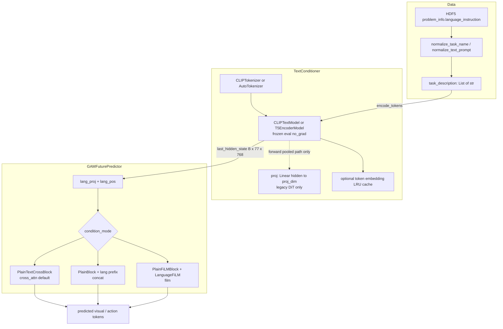

| 组件 | 文件 | 职责 |
|------|------|------|
| Dataset 任务字符串 | `src/robot/data/dataset.py` | 从 HDF5 / 文件名得到规范化 instruction |
| `TextConditioner` | `src/robot/modeling/conditioning.py` | 冻结 CLIP/T5 encode → token 隐状态 |
| `GAMFuturePredictor` | `src/robot/modeling/future_predictor.py` | `lang_proj` 映射到 `d_model`，再按 mode 融合 |
| `compute_gam_forward_loss` | `src/robot/losses/unified_loss.py` | 编排 `encode_tokens` → predictor |
| Eval policy helpers | `src/eval_libero_unified.py` | prompt 规范化、`text_cache`、审计字段 |

**依赖方向（单向）**：文本只进入 **predictor**；不进入 `DA3GiantEncoder` 浅层/深层，也不进入 `ActionHeadV2`。DA3 只看图像（与 action token）；动作头只看几何传播后的 action token。语言对动作的影响必须经过「predictor 改写未来几何/动作 seed → 深层精炼」这条链。

### 11.4 `TextConditioner`：冻结编码器，不是生成式 LLM

```16:67:src/robot/modeling/conditioning.py
class TextConditioner(nn.Module):
    """Frozen text encoder (CLIP or T5) with learnable projection.
    ...
    """
        ...
        self.encoder.eval()
        for p in self.encoder.parameters():
            p.requires_grad = False
```

两条 API：

1. **`encode_tokens(text_list, pad_to=77)`** — **GAM 主路径使用**  
   - tokenize → `max_length=pad_to` 填充/截断；  
   - `torch.no_grad()` 下跑 encoder，取 `last_hidden_state`；  
   - 返回 `(B, L, hidden_size)` 与 bool `attention_mask`；  
   - **不经过** `self.proj`。

2. **`forward(text_list)`** — **legacy DiT 池化路径**  
   - CLIP 用 `pooler_output`，T5 用 mask 平均；  
   - 再过可学习 `self.proj` 得到 `(B, proj_dim)`。

因此：checkpoint 里仍保存/加载 `text_conditioner_proj`（兼容与校验），但 **当前 GAM AR 训练/推理的有效语言投影是 predictor 内的 `lang_proj`，不是 `TextConditioner.proj`**。`encode_tokens` 注释写得很清楚：*caller is responsible for projecting hidden_size → predictor d_model*。

可选 LRU 缓存（`language_cache`）：按 `(encoder_type, pad_to, text)` 缓存隐状态，适合 LIBERO 任务句高度重复的场景，避免每 step 重复跑 CLIP。

### 11.5 三种语言融合模式（均非 CoT）

`GAMFuturePredictor.SUPPORTED_CONDITION_MODES = ("cross_attn", "concat", "film")`，默认 **`cross_attn`**（主配置未改 `condition_mode` 时即此）。

#### （A）`cross_attn`（默认）

1. `lang_proj(lang_feats) + lang_pos` → `(B, 77, d_model)`；  
2. 时间步 token 序列 **不** 与语言拼接；  
3. 每个 `PlainTextCrossBlock`：self-attn（block-causal）→ **cross-attn 到语言 KV** → FFN。

```742:749:src/robot/modeling/future_predictor.py
        if text_context is not None and text_context.shape[1] > 0:
            x = x + self.ls_cross(
                self.cross_attn(
                    self.norm_cross(x),
                    context=text_context,
                    keep_mask=text_keep_mask,
                )
            )
```

语义：几何/本体/动作历史在问「说明书里写了什么」，语言序列本身不参与时间因果自注意力，表示更「纯」。

#### （B）`concat`

语言 token 加 type embed 后 **前置** 到序列：`[lang | step_0 | step_1 | …]`。  
掩码约定（`_make_concat_lang_block_causal_mask_mod`）：

- 语言 query 只看语言（前缀内双向）；  
- 时间步 query 可看 **全部语言** + 因果可见的时间步。

这是「把指令 token 写进同一条自回归序列」，仍是 **条件注入**，不是让模型生成新的推理 token。

#### （C）`film`（OpenVLA-OFT 风格）

对语言做 masked-mean 池化成一个向量，经 `LanguageFiLM` 对 **视觉 token** 做 scale/shift；proprio / prev-action token 不调制，以免破坏数值语义。零初始化使训练起步近似恒等映射。

### 11.6 动态结构：训练 / 推理调用链

#### 训练（`compute_gam_forward_loss`）

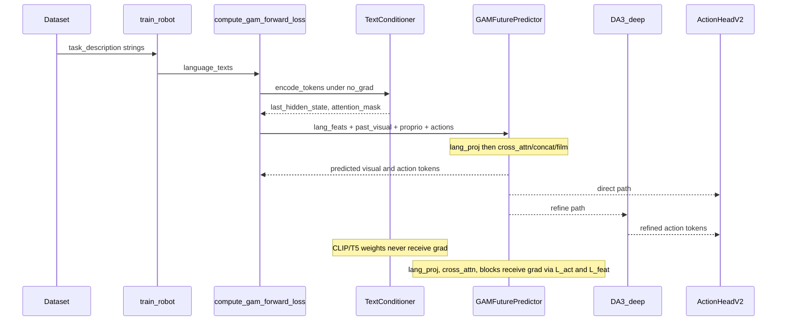

关键片段：

```1007:1012:src/robot/losses/unified_loss.py
    lang_feats = None
    lang_pad_mask = None
    if text_conditioner is not None and language_texts is not None:
        tok_out = text_conditioner.encode_tokens(language_texts, pad_to=future_predictor.language_len)
        lang_feats = tok_out["last_hidden_state"]
        lang_pad_mask = tok_out["attention_mask"]
```

若 `use_language=false` 或 `language_texts is None`，则 `lang_feats=None`，predictor 在无语言条件下仍可跑（消融开关；评估加载 ckpt 时若缺 `text_conditioner_proj` 且仍开语言会直接拒绝，避免随机语言投影）。

#### 推理（`eval_libero_unified`）

```2550:2565:src/eval_libero_unified.py
    def policy_text_prompt(task_desc: str) -> str:
        return normalize_text_prompt_for_policy(task_desc, text_prompt_normalization) or "perform the task"

    def predictor_text_tokens(task_desc: str) -> tuple[torch.Tensor | None, torch.Tensor | None]:
        ...
        if cache_key not in text_cache:
            with torch.no_grad():
                tok_out = text_conditioner.encode_tokens([cache_key], pad_to=future_predictor.language_len)
            text_cache[cache_key] = {...}
```

闭环每步：观测变、历史变，但 **同一 episode 的指令字符串通常不变**，故文本编码结果被缓存复用；真正每步重算的是浅层视觉、predictor（可 KV cache）、深层与 action head。这与「每步让 LLM 再 think 一段」完全不同。

### 11.7 Forward / Backward 细节

#### Forward（张量视角）

1. 字符串 → tokenizer ids `(B, 77)`；  
2. 冻结 CLIP/T5 → `lang_feats ∈ ℝ^{B×77×768}`（CLIP-L）或 T5 对应 `d_model`；  
3. `lang_proj: 768 → 1024`（predictor `d_model`）+ 可学习 `lang_pos`；  
4. 与视觉/本体/动作历史在 12 层块内交互；  
5. 读出未来几何与 action seed →（可选）DA3 deep → ActionHead → 7-DoF chunk。

**没有** 文本侧的 next-token loss、没有 KL 到教师 LLM、没有 process reward 对 reasoning trace 的监督。语言相关的学习信号全部来自下游的 $\mathcal{L}_{\text{act}}$、$\mathcal{L}_{\text{feat}}$（及可选 $\mathcal{L}_{\text{depth}}$）——即「在该指令条件下，几何与动作是否预测对」。

#### Backward（梯度视角）

| 参数 | 是否接收梯度 | 原因 |
|------|--------------|------|
| CLIP/T5 `encoder.*` | **否** | `requires_grad=False` + `encode_tokens` 包在 `no_grad` |
| `TextConditioner.proj` | 主路径 **实际不参与** | `encode_tokens` 绕过；legacy DiT 才会用 |
| `GAMFuturePredictor.lang_proj` / `lang_pos` | **是** | 连接冻结特征与 predictor |
| cross-attn / FiLM / concat 相关块 | **是** | 经预测误差回传 |
| DA3 浅层 0–12 | **否** | 冻结 + shallow detach |
| DA3 深层 / ActionHead | **是** | 标准策略损失 |

因此语言塔是 **特征提取器**，不是端到端微调的 VLM。论文 Limitation 写「语言推理受冻结文本编码器限制」，与此实现完全一致：模型无法通过反传改写 CLIP/T5 的语义空间，只能学习「如何读已有语义特征」。

### 11.8 与「真·LLM/VLM 策略」的对比

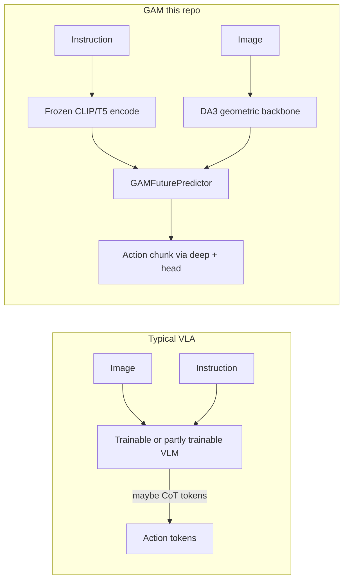

| 维度 | 典型带 CoT 的 VLM 策略 | 本仓库 GAM |
|------|------------------------|------------|
| 文本输出 | 可能生成计划/推理词 | **无文本输出** |
| 文本输入用法 | 提示词 + 可能多轮 | 单句 instruction → 固定长 embedding |
| 可训练语言参数 | 常含 LoRA/全量 LLM | 仅 predictor 侧投影与注意力 |
| 计算瓶颈 | LLM 解码步数 | DA3 + 12L predictor 单次前向 |
| 关闭语言 | 任务常不可用 | `use_language=false` 可作消融 |

`action_head_oft.py` 注释提到「VLM hidden states」是 **另一类动作头接口的设计说明**，不是当前 GAM 主路径在跑一个 VLM；主路径 action 来自 DA3 action token + `ActionHeadV2`。

### 11.9 配置与消融开关速查

| 键 / 行为 | 作用 |
|-----------|------|
| `predictor.use_language` | 总开关；`false` 则无语言条件 |
| `predictor.language_encoder_type` | `"clip"`（默认）或 `"t5"` |
| `predictor.clip_model` / T5 模型名 | HuggingFace 权重名 |
| `predictor.language_dim` / `language_len` | 须与编码器隐维、pad 长度一致（CLIP-L: 768 / 77） |
| `predictor.condition_mode` | `cross_attn` \| `concat` \| `film` |
| `predictor.language_cache*` | 训练期 token 缓存 |
| Eval `text_prompt_normalization` | 与 HDF5 训练字符串对齐 |

### 11.10 本章小结

1. **文本路径短而清晰**：HDF5 instruction → 规范化字符串 → 冻结 CLIP/T5 `encode_tokens` → predictor `lang_proj` → cross-attn（默认）条件融合 → 影响未来几何与动作预测。  
2. **未使用** CoT、thinking、reasoning trace、chat、文本自回归生成等 LLM/VLM 常用「显式推理」技术。  
3. **用到的「语言技术」** 属于经典条件注入：冻结双塔/编码器特征 + cross-attn / concat / FiLM，外加 prompt 规范化与 embedding 缓存。  
4. **Forward** 中文本编码无梯度；**Backward** 只更新 predictor（及后续动作/深层）里读语言的那部分权重。  
5. 这解释了论文与代码的共同取向：几何是策略基底，语言是 **任务偏置**，不是逐步推理引擎——也解释了 Limitation 中语言能力的上限来自何处。

---

*文档版本：与本地 Geometric-Action-Model 代码库对照撰写。若论文修订或代码重构，请优先以 `src/` 与当前 YAML 为准，并回看 §4.6 的差异表与 §11 文本专章。*
